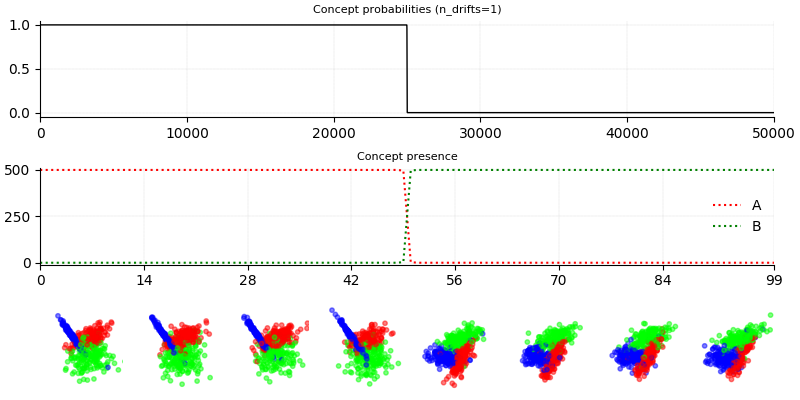
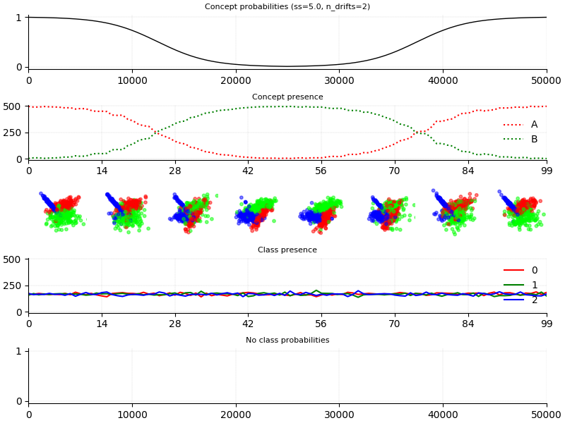
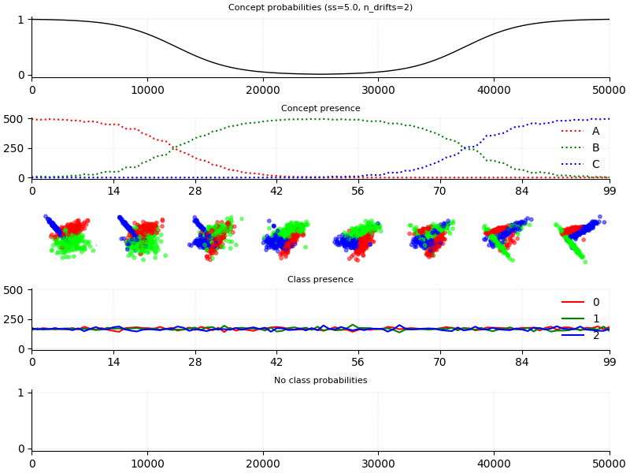

# stream-learn

[](https://travis-ci.org/w4k2/stream-learn)
[](https://coveralls.io/github/w4k2/stream-learn?branch=master)
[](https://circleci.com/gh/w4k2/stream-learn/tree/master)

stream-learn is a Python package equipped with a procedures to process data streams using estimators with API compatible with scikit-learn.

## Documentation

API documentation with set of examples may be found on the [documentation page](https://w4k2.github.io/stream-learn/).

## Installation

stream-learn is available on the PyPi and you may install it with pip:

```
pip install stream-learn
```

## Streams

### Stationary


### Sudden drift


### Incremental drift


### Reocurring drift


### Non-reocurring drift


---

### Balanced stream


### Stationary imbalanced stream


### Dynamically imbalanced stream


### DISCO


## Example usage

```python
WRONG
```

<!--
### About

If you use stream-learn in a scientific publication, we would appreciate citations to the following paper:

```
@article{key:key,
author  = {abc},
title   = {def},
journal = {ghi},
year    = {2018},
volume  = {1},
number  = {1},
pages   = {1-5},
url     = {http://jkl}
}
```
-->
